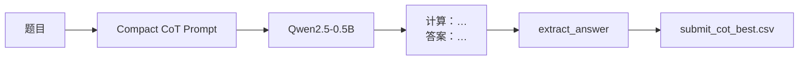

# 小学数学应用题自动解题 — 方案实施报告

**赛题**：[DataFountain 467 — 小学数学应用题自动解题](https://www.datafountain.cn/competitions/467)  
**基础模型**：Qwen2.5-0.5B-Instruct（符合 ≤0.5B 限制）  
**报告日期**：2026-06  

---

## 一、任务与数据

| 项目 | 说明 |
|------|------|
| 输入 | 小学 1–6 年级数学应用题（`question` + `instruction`） |
| 输出 | 纯数字 / 分数 / 百分数答案（CSV 列 `ret`，**无表头**） |
| 训练集 | `train.json`，约 12 000 条（含标签，仅用于训练/验证） |
| 测试集 | `test.json`，8 000 条（无标签，用于提交） |
| 本地验证集 | `dev.json`，500 条（从 `train.json` 按 seed=42 划分） |
| 评估指标 | 正确率（预测与标准答案一致的比例） |

---

## 二、已完成方案概览

本项目完成 **两套独立方案**，均基于 Qwen2.5-0.5B-Instruct：

| 方案 | 思路 | 是否微调 | 正式提交文件 |
|------|------|----------|--------------|
| **方案 A：CoT 提示词推理** | 思维链 Prompt + 答案提取，不训练权重 | 否 | **`submit_cot_best.csv`** |
| **方案 B：DeepSeek 蒸馏 + LoRA** | 教师模型生成 CoT → 学生 LoRA 微调 | 是 | **`submit_distill_best.csv`** |

方案 B 权重：`release/qwen-distill-lora-best/`（merged 副本，对应最佳蒸馏 checkpoint）。

另曾尝试「直接输出数字」的 LoRA 微调（无 CoT），平台正确率约 **0.13–0.14**，低于上述两方案，不作为正式提交方案。

---

## 三、方案 A：Qwen2.5-0.5B + CoT 提示词推理

### 3.1 思路

不修改模型权重，通过 **Compact CoT Prompt** 引导 0.5B 模型先写简短算式，再输出 `答案：数字`；用规则从生成文本中提取最终数值提交。



### 3.2 核心代码

| 文件 | 作用 |
|------|------|
| `cot_core.py` | CoT 提示词、题型分类、Few-shot、`extract_answer()` |
| `ollama_client.py` | Ollama 本地推理客户端 |
| `cot_gpu.py` | **GPU 推理**（Transformers，无需 Ollama） |
| `cot_infer.py` | 批量生成提交 CSV，支持 `--backend gpu\|ollama\|auto` |
| `eval.py` | 在 `dev.json` 上评估 CoT 正确率 |

### 3.3 最佳 Prompt 与解码参数

经 `param_sweep.py` 在 dev-50 上对比，**最优组合**为：

| 配置项 | 取值 |
|--------|------|
| `prompt_mode` | **compact** |
| `temperature` | **0.0**（greedy） |
| `top_p` | **1.0** |
| `repeat_penalty` | 1.1 |
| `num_predict` / `max_new_tokens` | 96（Ollama）/ 128（GPU） |

Compact 系统提示结构（节选）：

```text
你是小学数学应用题助手。先列算式再给出最终数字答案（不带单位）。
[动态 hint：至少/至多/分数/单位换算]
示例：… 计算：… 答案：85
格式：计算：<算式>  答案：<数字>
```

常量定义见 `cot_core.py` 中 `BEST_PROMPT_MODE`、`build_compact_prompt()`。

### 3.4 运行方式

**云端 GPU（推荐，ModelScope DSW 无 Ollama 时）：**

```bash
python cot_infer.py --backend gpu \
  --prompt-mode compact \
  --output submit_cot_best.csv
```

**本地 Ollama：**

```bash
python cot_infer.py --backend ollama \
  --prompt-mode compact \
  --output submit_cot_best.csv
```

**本地 dev 评估：**

```bash
python eval.py --dev-size 500 --prompt-mode compact
```

### 3.5 实验结果

#### 解码参数对比（dev-50，Ollama）

| 配置 | 正确率 |
|------|--------|
| baseline (T=0.3, top_p=0.9) | 28% |
| **greedy (T=0.0, top_p=1.0)** | **36%** |
| long_out (num_predict=384) | 32% |
| low_temp_rp12 | 20% |

来源：`param_sweep_50.json`、`eval_report_50_greedy.json`

#### 主验证结果（compact + greedy）

| 验证集规模 | 正确 | 总数 | 正确率 |
|------------|------|------|--------|
| dev-50 | 18 | 50 | **36.0%** |
| dev-500 | 205 | 500 | **41.0%** |

来源：`eval_report_50_greedy.json`、`eval_report_500.json`

#### dev-500 分题型正确率（CoT）

| 题型 | 样本数 | 正确率 |
|------|--------|--------|
| remainder（剩余） | 56 | 51.8% |
| average（平均） | 54 | 50.0% |
| at_least | 11 | 45.5% |
| general | 79 | 41.8% |
| ratio | 108 | 38.0% |
| unit_convert | 287 | 37.3% |
| at_most | 10 | 40.0% |
| fraction | 53 | 26.4% |
| **decimal** | 63 | **20.6%** |

**薄弱环节**：小数题、分数题。

#### 测试集提交

| 文件 | 行数 | 说明 |
|------|------|------|
| **`submit_cot_best.csv`** | 8000 | 方案 A **正式提交**（compact + greedy，GPU 全量推理） |

> 平台分数以 DataFountain 实测为准；本地 dev-500 约 41%，为两方案中**本地验证最高**。

### 3.6 方案 A 小结

- **优点**：无需训练，部署简单；dev 正确率明显高于蒸馏与直接微调。  
- **缺点**：全量 8000 条 GPU 推理约 1 小时；0.5B 在小数/分数题上仍偏弱。  
- **结论**：作为**主推提交方案**，正式文件为 **`submit_cot_best.csv`**。

---

## 四、方案 B：DeepSeek 蒸馏 + Qwen LoRA 微调

### 4.1 思路

用 **DeepSeek API**（教师）对 `train.json` 生成 Compact CoT 解答，筛选/格式化后作为监督信号，对 **Qwen2.5-0.5B** 做 LoRA SFT；推理时仍用 CoT Prompt + `extract_answer()`。


### 4.2 核心代码

| 文件 | 作用 |
|------|------|
| `deepseek_client.py` | DeepSeek API（与 compact CoT 对齐的 messages） |
| `build_distill_train.py` | 生成 `train_distill.json`（支持断点、并发） |
| `run_distill_pipeline.py` | 蒸馏 → 训练 → 推理一键流水线 |
| `qwen_ft.py` | LoRA 训练（`--mode cot`） |
| `ft_utils.py` | CoT 训练/推理共用模板与 `format_cot_prediction()` |
| `ft_infer.py` | 加载 merged/LoRA 权重推理 |
| `check_training.py` | 训练 loss / 步数收敛检查 |

### 4.3 蒸馏数据

- **教师模型**：`deepseek-chat`（API Key：`api_key.txt` 或 `DEEPSEEK_API_KEY`）  
- **训练目标格式**（`cot_response`）示例：

```text
计算：105×3=315
答案：315
```

- **生成命令**：

```bash
python build_distill_train.py --workers 4 --output train_distill.json
# 高质量版本（可选）：
python build_distill_train.py --only-correct --on-wrong skip --rebuild
```

### 4.4 训练配置

| 超参数 | 取值 |
|--------|------|
| 基座 | Qwen2.5-0.5B-Instruct |
| 方法 | LoRA（r=8, alpha=32, dropout=0.1） |
| `max_length` | 768 |
| batch × grad_accum | 4 × 4 |
| learning_rate | 1e-4 |
| epochs | 5（v1 最佳）；v2 曾试 3 + 5e-5，效果更差 |
| 训练模式 | `--mode cot` |
| 合并权重 | `--merge-lora` → `merged/` |

**最佳权重路径（云端训练产物）：**

```text
output/qwen-distill-lora/merged/          # 原始最佳（平台 ~0.274）
release/qwen-distill-lora-best/           # 已推送仓库的 merged 副本
```

**不推荐**：`output/qwen-distill-lora-v2/`（方案 4 重训，正确率略降）

### 4.5 运行方式

**完整流水线：**

```bash
python run_distill_pipeline.py --only-correct --merge-lora --epochs 5
```

**仅推理（已有权重）：**

```bash
python ft_infer.py --mode cot \
  --checkpoint release/qwen-distill-lora-best \
  --test test.json \
  --output submit_distill_best.csv \
  --dev dev.json \
  --report output/qwen-distill-lora/dev_report.json
```

### 4.6 实验结果

#### 平台正确率（DataFountain 测试集）

| 提交文件 | 平台得分 | 备注 |
|----------|----------|------|
| 直接数字 LoRA（早期） | ~0.13–0.14 | 未采用 |
| **`submit_distill_best.csv`** | **~0.274** | 方案 B 最佳 |
| `submit_distill_v2.csv` | 略低于 v1 | only-correct + 减 epoch 重训 |

#### 与方案 A 预测一致性（test 8000 条）

| 对比 | 答案相同比例 |
|------|----------------|
| **`submit_cot_best.csv` vs `submit_distill_best.csv`** | **27.2%**（2174/8000） |
| `submit_distill_best.csv` vs `submit_distill_v2.csv`（历史） | 56.0% |

说明：蒸馏模型与纯 CoT **解题路径差异大**；蒸馏并未复现 CoT 基线的 dev 高水平。

#### 训练收敛（参考）

- 训练 loss：约 2.3 → **1.15** 后横盘（5 epoch 跑满 ~3750 step）  
- loss ≈ 1.15 对应端到端正确率约 **10%–15%** 量级，与平台 ~0.27 一致（蒸馏略优于 loss 隐含水平，因 CoT 格式与提取有帮助）

### 4.7 方案 B 小结

- **优点**：满足「微调 / 蒸馏」类方案汇报；可复现教师 CoT 格式；权重可打包发布。  
- **缺点**：平台分 **0.274 < 0.30**；低于纯 CoT 的 dev 41%；v2 优化（更干净数据 + 少 epoch）反而略降。  
- **结论**：作为**第二方案**提交与报告；冲榜仍应以方案 A 为主。

---

## 五、两方案对比

| 维度 | 方案 A：CoT | 方案 B：DeepSeek 蒸馏 |
|------|-------------|------------------------|
| 是否训练 | 否 | 是（LoRA） |
| 教师模型 | — | DeepSeek API |
| 推理入口 | `cot_infer.py` | `ft_infer.py --mode cot` |
| **正式提交文件** | **`submit_cot_best.csv`** | **`submit_distill_best.csv`** |
| 本地 dev-500 | **41.0%** | 未稳定高于 CoT（平台 ~27%） |
| 平台测试集 | 以 `submit_cot_best.csv` 提交为准 | **~0.274** |
| 算力需求 | 推理 GPU ~1h | 蒸馏 API + 训练 GPU ~1–2h |
| 主要瓶颈 | 小数/分数题 | 小模型微调易遗忘推理能力 |

---

## 六、关键经验

1. **0.5B 做应用题需要推理链**：直接输出数字（SFT 或赛题 instruction）效果差（~13%）。  
2. **Prompt 调参有效但有限**：greedy + compact 优于 sampling；过多 hint 曾使 dev 从 36% 降至 30%。  
3. **蒸馏不等于变强**：教师答对样本变少、epoch 减少可能导致 v2 不如 v1。  
4. **评估规范**：用 `dev.json` 看 dev accuracy；不要用 test 的 id 去对 train 标签算分。  
5. **提交格式**：CSV **无表头**，`id,ret` 共 8000 行；需清理 `Human:` 污染（`clean_submit.py` / `format_cot_prediction`）。

---

## 七、仓库文件索引

```
PJ2/
├── cot_core.py              # CoT 提示词与答案提取
├── cot_infer.py             # 方案 A 批量推理
├── cot_gpu.py               # 方案 A GPU 后端
├── ollama_client.py
├── eval.py                  # dev 评估
├── deepseek_client.py       # 方案 B 教师 API
├── build_distill_train.py   # 生成蒸馏数据
├── run_distill_pipeline.py
├── qwen_ft.py               # LoRA 训练
├── ft_infer.py              # 方案 B 推理
├── ft_utils.py
├── submit_cot_best.csv      # 方案 A 正式提交
├── submit_distill_best.csv  # 方案 B 正式提交
└── release/
    └── qwen-distill-lora-best/   # 方案 B  merged 权重
```

---

## 八、复现检查清单

- [ ] `train.json` / `test.json` 就绪  
- [ ] 方案 A：`python cot_infer.py --backend gpu --output submit_cot_best.csv`  
- [ ] 方案 B：`api_key.txt` → `build_distill_train.py` → `qwen_ft.py --mode cot --merge-lora` → `ft_infer.py --output submit_distill_best.csv`  
- [ ] dev 评估：`python eval.py --prompt-mode compact`  
- [ ] 提交前：`wc -l submit_cot_best.csv submit_distill_best.csv` 均为 8000，无表头，无 `Human:` 脏数据  

---

*本报告对应课程项目 PJ2，两套方案均已实现并可复现。*
